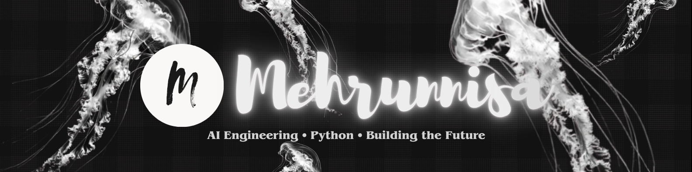

  

<h2 align="center">Hey, I'm Mehrunnisa 👋</h2>

  <b>BCA Student • Aspiring AI Engineer • Python Learner</b>

  I'm documenting my journey from Python fundamentals to AI Engineering,
  one concept, project, and late-night debugging session at a time. 🐍

<h2 align="center">📚 Currently Learning</h2>

  Python &nbsp; • &nbsp;
  Mathematics &nbsp; • &nbsp;
  AI Fundamentals &nbsp; • &nbsp;
  Computer Science

<h2 align="center">🛠️ Tech Stack</h2>

  

<h2 align="center">📊 GitHub Stats</h2>

  
  

## ♡ How to Reach Me

* GitHub: @mehrunnisaofficial
* Email: [mehrunnisa.officialll@gmail.com](mailto:mehrunnisa.officialll@gmail.com)
